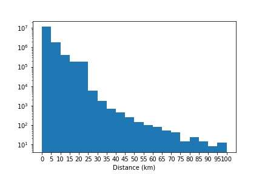
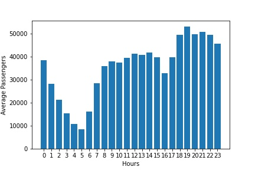
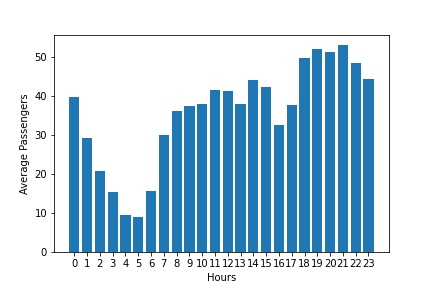

# habibis-taxi
 
# Title: Investigation on taxi data set. 

## Description:

- This project is built to analyze a dataset about taxi rides in NYC, and to get a basic idea of what is important in the data

- Data are extracted from trip_data_6.csv dataset.

- In this project raw data is used. (Data is not cleaned and some out of range data might exist)


## 1. Question 1:

Two colums in the taxi dataset can be considered as date time type, whichare pickup_datetime and dropoff_datetime. For those columns minimum and maximum dates have been found.

- Pythan Code for extracting minimum and maximum **pickup_datetime** column:

```python

import csv, datetime

data = 'trip_data_6.csv'
f = open(data, 'r')
reader = csv.reader(f)
n = 0
minval = None
maxval = None
n = 0
for row in reader:
    if n > 0:
        dto = None
        dts = row[5]
        try:
            dto= datetime.datetime.strptime(dts,"%Y-%m-%d %H:%M:%S")
        except Exception as e:
            print(e)
        if dto is not None:
            if maxval is None or dto > maxval:
                maxval = dto
            elif minval is None or dto < minval:
                minval = dto
    n+=1
print('min_pickup_date:', minval, ', max_pickup_date:' , maxval)

```

### Result:

`min_pickup_date: 2013-06-01 00:00:00 , max_pickup_date: 2013-06-30 23:59:56`

**Interpration:** The trip_data_6.csv for covers dates between 2013-06-01 00:00:00 and 2013-06-30 23:59:56 for the pickup_date row.


- The minimum and maximum datetime, that the data set coves for **dropoff_datetime** column, is obtained using the following code:

```Python
data = 'trip_data_6.csv'

f = open(data, 'r')
reader = csv.reader(f)
n = 0
minval = None
maxval = None
n = 0
for row in reader:
    if n > 0:
        dto = None
        dts = row[6]
        try:
            dto= datetime.datetime.strptime(dts,"%Y-%m-%d %H:%M:%S")
        except Exception as e:
            print(e)
        if dto is not None:
            if maxval is None or dto > maxval:
                maxval = dto
            elif minval is None or dto < minval:
                minval = dto
    n+=1
print('min_dropoff_date:', minval, ', max_dropoff_date:' , maxval)
```

### Result:

`min_dropoff_date: 2013-03-22 08:04:00 , max_dropoff_date: 2013-07-01 01:14:24`

**Interpration:** 

The date time that dropoff_datetime column covers is between  2013-03-22 08:04:00 and 2013-07-01 01:14:24. However, the minimum date time seems to be entered incorrectly in the dataset because it does not have any related pick up time (it does not make sense to drop off a passenger before picking them up). As it seems some data was entered to the csv file incorrectly, we need to replace/remove that rows to have more reliable information if we need more reliable information.


- The following code reads the csv file and print the number of rows that it reads:

```python
import csv, datetime

data = 'trip_data_6.csv'

f = open(data, 'r')
reader = csv.reader(f)
n = 0
for row in reader:
    if n % 50000 == 0:
        print(n)
    n+=1

print(n)
```
### Interpration of the result:

The last integer that the above code is printing is `14385457`, which is the total rows in 'trip_data_6.csv' file.

## 2. Question 2:

Names of fields are driven as below:

```python
import csv

data = 'trip_data_6.csv'

f = open(data, 'r')
reader = csv.reader(f)
n = 0
for row in reader:
    print(row)
    break

print(reader)
```

### Result:

`['medallion', ' hack_license', ' vendor_id', ' rate_code', ' store_and_fwd_flag', ' pickup_datetime', ' dropoff_datetime', ' passenger_count', ' trip_time_in_secs', ' trip_distance', ' pickup_longitude', ' pickup_latitude', ' dropoff_longitude', ' dropoff_latitude']
<_csv.reader object at 0x05B35DB8>`

As it can be seen, the trip_data_6.csv dataset contains 14 columns with above field names. Here is some description for each field:

`Medallion`: Is a Certificate of Public Necessity and Convenience that taxis should hav eto be able to passengers. 

`hack_license`: Is the license that allow drivers to drive a yellow cab

`vendor_id`: A code indicating the TPEP provider that provided the record. 

`rate_code`:The final rate code in effect at the end of the trip.


`store_and_fwd_flag`: This flag indicates whether the trip record was held in vehicle memory before sending to the vendor, aka “store and forward,” because the vehicle did not have a connection to the server.

`pickup_datetime`: The date and time when the meter was engaged. 

`dropoff_datetime`: The date and time when the meter was disengaged

`passenger_count`: The number of passengers in the vehicle. 

`trip_time_in_secs`:The time is second that passengers are in the taxi.

`trip_distance`: The elapsed trip distance in miles reported by the taximeter.

`pickup_longitude`: A longitude in which passengers are pickedup.

`pickup_latitude`: A latitude in which passengers are picked up.

`dropoff_longitude`: A longitude in which passengers are dropped off.

`dropoff_latitude`: A latitude in which passengers are dropped off.

## 3. Question 3:

As a sample data we can observe the firt five rows and the related field names:

```python
import csv

data = 'trip_data_6.csv'

f = open(data, 'r')
reader = csv.reader(f)
n = 0
for row in reader:
    print(row)
    n+=1
    if n > 5:
        break
```

### Result:

`['medallion', ' hack_license', ' vendor_id', ' rate_code', ' store_and_fwd_flag', ' pickup_datetime', ' dropoff_datetime', ' passenger_count', ' trip_time_in_secs', ' trip_distance', ' pickup_longitude', ' pickup_latitude', ' dropoff_longitude', ' dropoff_latitude']
['D1C79CF706C80D3A1DC7FBCA6CD56E43', 'DAC7742E8F00034774098DBC6B4FF2B7', 'CMT', '1', 'N', '2013-06-03 00:02:12', '2013-06-03 00:10:07', '1', '474', '1.30', '-73.981583', '40.773529', '-73.981827', '40.782124']
['3567E8B49FEBFCBB587F1864D723D5C8', '430B8022563CDE1D51D44786DFD8D6CB', 'CMT', '1', 'N', '2013-06-03 00:03:03', '2013-06-03 00:19:27', '1', '982', '4.90', '-73.999565', '40.728367', '-73.952927', '40.729546']
['4220E1995D36A40DF34664AD33ED13F6', '48A1C9C9300AFC7BDBB718CE308EE45A', 'CMT', '2', 'N', '2013-06-03 00:01:30', '2013-06-03 00:28:11', '1', '1745', '17.70', '-73.788445', '40.641151', '-73.985451', '40.744194']
['440900089FF528A873424DED689C77A3', 'E6A63B40E565A8A03AF32E0B138F5EB1', 'CMT', '1', 'N', '2013-06-03 00:04:14', '2013-06-03 00:27:50', '1', '1415', '12.10', '-73.862816', '40.768875', '-74.008797', '40.738842']
['16129167D9E7B0846DBA3D04B78E1B8D', '227A03FC03CF429DFC9EAFF0AE8BA579', 'CMT', '1', 'N', '2013-06-03 00:04:53', '2013-06-03 00:10:46', '1', '353', '1.10', '-73.964905', '40.806881', '-73.962349', '40.794987']`


## 4. Question 4:

If we want to save the data in mysql, data should be stored in the following types:

`medallion` : varchar(32)  , `hack_license` : varchar(32) , `vendor_id`: varchar(3)  ,  `rate_code`: int(3)  ,  `store_and_fwd_flag`: varchar(1) ,  `pickup_datetime`: datetime  , `dropoff_datetime`: datetime  , `passenger_count`: int(3)  , `trip_time_in_secs`: int()  , `trip_distance`:  decimal(5,2)  ,  pickup_longitude: decimal(3,6)  ,  `pickup_latitude`: decimal(3,6) ,  `dropoff_longitude`: decimal(3,6)  , `dropoff_latitude`: decimal(3,6)


## 5. Question 5:

- The below code gist of the geographic range of your data, but before to get to that there is something to consider:


In some rows, the latitude and longitude values were not a number, some of them were 0 ,and some of them were out of the conventional range of -180<longitude<180 and -90<latitude<90. Therefore these data were excluded.


```python
import csv, datetime
data= 'trip_data_6.csv'

f= open(data, 'r')
reader = csv.reader(f)


n = 0


for row in reader:
    if n==1:
        lon_min = float(row[10])
        lat_min = float(row[11])
        lon_max = float(row[12])
        lat_max = float(row[13])
    elif n > 1:
        try:
            pick_lon = float(row[10])
            pick_lat = float(row[11])
            drop_lon = float(row[12])
            drop_lat = float(row[13])
        except Exception as e:
            print(e)
        
        if pick_lon!=0.0 and abs(pick_lon)<=180:
            if pick_lon < lon_min:
                lon_min = pick_lon
            if pick_lon > lon_max:
                lon_max = pick_lon
 
        if pick_lat!=0.0 and abs(pick_lat)<=90:
            if pick_lat < lat_min:
                lat_min = pick_lat
            if pick_lat > lat_max:
                lat_max = pick_lat

        if drop_lon!=0.0 and abs(drop_lon)<=180:
            if drop_lon < lon_min:
                lon_min = drop_lon
            if drop_lon > lon_max:
                lon_max = drop_lon

        if drop_lat!=0.0 and abs(drop_lat)<=90:
            if drop_lat < lat_min:
                lat_min = drop_lat
            if drop_lat > lat_max:
                lat_max = drop_lat
       
             
    if n % 50000 == 0:
        print(n)
    n+=1

print(n)

print('min_longitude:',lon_min, 'max_longitude:',lon_max, 'min_latitude:',lat_min, 'max_latitude:',lat_max)
print('Point 1:', lon_min, lat_min)
print('Point 2:', lon_min, lat_max)
print('Point 3:', lon_max, lat_max)
print('Point 4:', lon_max, lat_min)
```

### Result:


## 6. Question 6:

- Average distance that passengers traveledare driven from the following code:

Some of the values related distances were very high(up to the order of 10,000), which did not seem resonable. Therefor, a limit value of 100 kilomiter wasconsidered for the trip distance ,and all of the data with a distance of more than 100 were excluded.

 distances over 100 killomwter were excluded
```python
from math import radians, cos, sin, asin, sqrt
def haversine(lon1, lat1, lon2, lat2):
    """
    Calculate the great circle distance in kilometers between two points 
    on the earth (specified in decimal degrees)
    """
    # convert decimal degrees to radians 
    lon1, lat1, lon2, lat2 = map(radians, [lon1, lat1, lon2, lat2])

    # haversine formula 
    dlon = lon2 - lon1 
    dlat = lat2 - lat1 
    a = sin(dlat/2)**2 + cos(lat1) * cos(lat2) * sin(dlon/2)**2
    c = 2 * asin(sqrt(a)) 
    r = 6371 # Radius of earth in kilometers. Use 3956 for miles. Determines return value units.
    return c * r
    
import csv, datetime
data= 'trip_data_6.csv'

f= open(data, 'r')
reader = csv.reader(f)

n = 0
distance=[]
sum_distance=0

for row in reader:
    if n==1:
        lon_min = float(row[10])
        lat_min = float(row[11])
        lon_max = float(row[12])
        lat_max = float(row[13])
    elif n > 1:
        try:
            pick_lon = float(row[10])
            pick_lat = float(row[11])
            drop_lon = float(row[12])
            drop_lat = float(row[13])
            if pick_lon!=0.0 and abs(pick_lon)<=180 and drop_lon!=0.0 and abs(drop_lon)<=180 and pick_lat!=0.0 and abs(pick_lat)<=90 and drop_lat!=0.0 and abs(drop_lat)<=90:
                dist=haversine(pick_lon, pick_lat, drop_lon, drop_lat)
                if dist<=100:
                    distance.append(dist)
                    sum_distance+=dist
        except Exception as e:
            print(e)           
    
    if n % 50000 == 0:
        print(n)
    n+=1

print('Average Distance=', sum_distance/(n-1), 'km')

```

### Result:

Average Distance= 3.3888207386530746


- The code for drawing the histogram of the trip distances:

```python
import matplotlib.pyplot as plt
plt.hist(distance, bins=range(0,101,5), log=True)
plt.xlabel('Distance (km)')
plt.xticks(range(0,101,5))
plt.savefig('Distance_Distribution.jpg')
```

### Result: 



**Assumptions:** 
As it is mentioned before, a limit value of 100 kilomiter was considered for the trip distances. In addition, since the range of data was so wide,  the y axis is ploted in log scale.

## 7. Question 7:

Finding distinct values are applicabale for some columns. 


1- vendor_id

2- store_and_fwd_flag

3- rate_code

4- passenger_count


- The following code is used for finding distinct `vendor_id` and the number of the accurance of disctinct values:

 ```python
import csv
data = 'trip_data_6.csv'

f = open(data, 'r')
reader = csv.reader(f)

vendor_id_distinct = {}

n=0
for row in reader:
    if n>0:
        k = row[2]
        if k in vendor_id_distinct:
            vendor_id_distinct[k] += 1
        else:
            vendor_id_distinct[k] = 1
        if n % 500000 == 0:
            print(n)
        
    n+=1

print(vendor_id_distinct)
 ```

### Result:

`{'CMT': 7169244, 'VTS': 7216212}`

**Interpration:** CMT and VTS are two vendor_id that is used in the data set which have been repited 7169244 and 7216212 respectively.


- The following code is used for finding distinct `store_and_fwd_flag` and the accurance of those disctinct values:

```python
import csv
data = 'trip_data_6.csv'

f = open(data, 'r')
reader = csv.reader(f)
store_and_fwd_flag = {}

i=0
n=0

for row in reader:
    if i>0:
        k = row[4]
        if k in store_and_fwd_flag:
            store_and_fwd_flag[k] += 1
        else:
            store_and_fwd_flag[k] = 1
        if n % 500000 == 0:
            print(n)
        n+=1
    i+=1

print(store_and_fwd_flag)
```

### Result:

`{'N': 6906120, 'Y': 256624, '': 7222712}`

**Interpration:** N, Y and '' are distict store_and_fwd_flag in this data set. A s it can be seen 7222712 of rows are empty for this column, so we should consider this field as a null.


- The following code is used for finding distinct `rate_code` and the accurance of those disctinct values:

```python
import csv
data = 'trip_data_6.csv'

f = open(data, 'r')
reader = csv.reader(f)
rate_code = {}

i=0
n=0

for row in reader:
    if i>0:
        k = row[3]
        if k in rate_code:
             rate_code[k] += 1
        else:
             rate_code[k] = 1
        if n % 500000 == 0:
            print(n)
        n+=1
    i+=1

print(rate_code)
```

### Result:

`{'1': 14053347, '2': 257221, '5': 39362, '3': 22131, '4': 6348, '6': 178, '0': 6847, '8': 7, '210': 13, '77': 1, '9': 1}`

**Interpration:** 0,1, 2, 3, 4, 5, 6, 8, 9, 77 and 210 are distict number of passengers in this data set. However 77 and 210 seems to be unresonable. not only because it is occured only 1 and 13 in the whole dataset respectively, but also it seems that the rate_code can have values between 0 and 10(at least for cleaning the data set we can have this assumption).


- The following code is used for finding distinct `passenger_count` and the accurance of those disctincts values:

```python
import csv
data = 'trip_data_6.csv'

f = open(data, 'r')
reader = csv.reader(f)
passenger_count = {}

i=0
n=0

for row in reader:
     if i>0:
        k = row[7]
        if k in passenger_count:
             passenger_count[k] += 1
        else:
             passenger_count[k] = 1
        if n % 500000 == 0:
             print(n)
        n+=1
     i+=1

print(passenger_count)
```

### Result:

`{'1': 10091826, '2': 1941858, '3': 620138, '4': 303352, '5': 845641, '6': 582146, '0': 490, '8': 4, '208': 1}`

**Interpration:** 1, 2, 3, 4, 5, 6, 0, 8 and 208 are distict number of passengers in this data set. However 208 seems to be unreseneable. not only because it is occured only once i the whole dataset, but also it is not logical that a taxi(even a van taxi) can have 208 passengers.

## 8. Question 8:

Minimum and max values for columns containing numeric values:

Columns with numeric types besides lat and lon are: `passenger_count` , `rate_code`  , `trip_time_in_secs`,  `trip_distance ` ,   


-Minimum and max values for columns

```python
import csv
data = 'trip_data_6.csv'
f= open(data, 'r')
reader = csv.reader(f)


n = 0
for row in reader:
    if n==1:
        rate_code_min = int(row[3])
        rate_code_max = int(row[3])
        passenger_count_min = int(row[7])
        passenger_count_max = int(row[7])
        trip_time_min = int(row[8])
        trip_time_max = int(row[8])
        trip_distance_min = float(row[9])
        trip_distance_max = float(row[9])
    elif n > 1:
        try:
            rate_code=int(row[3])
            passenger_count = int(row[7])
            trip_time = int(row[8])
            trip_distance = float(row[9])
        except Exception as e:
            print(e)     
            
        if rate_code<rate_code_min:
            rate_code_min=rate_code
        elif rate_code>rate_code_max:
            rate_code_max=rate_code
        
        if passenger_count<passenger_count_min:
            passenger_count_min=passenger_count
        elif passenger_count>passenger_count_max:
            passenger_count_max=passenger_count
            
        if trip_time<trip_time_min:
            trip_time_min=trip_time
        elif trip_time>trip_time_max:
            trip_time_max=trip_time
            
        if trip_distance<trip_distance_min:
            trip_distance_min=trip_distance
        elif trip_distance>trip_distance_max:
            trip_distance_max=trip_distance
            
    
    if n % 50000 == 0:
        print(n)
    n+=1

print('min rate code=',rate_code_min,'max rate code=',rate_code_max)
print('min passenger count=',passenger_count_min,'max passenger count=',passenger_count_max)
print('min trip time=',trip_time_min,'max trip time=',trip_time_max)
print('min trip distance=',trip_distance_min,'max trip distance=',trip_distance_max)

```

### Result:

`min rate code= 0 max rate code= 210`

`min passenger count= 0 max passenger count= 208`

`min trip time= 0 max trip time= 10800`

`min trip distance= 0.0 max trip distance= 100.0`


## 9. Question 9:

The code below was was used to find the average number of passengers. The assumption is to find the average numbers from the pick up column. 

```python
import csv, datetime
from datetime import timedelta
data = 'trip_data_6.csv'

f = open(data, 'r')
reader = csv.reader(f)
minval = None
maxval = None
n = 0

hours={i:0 for i in range(0,24)}

for row in reader:
    if n > 0:
        dto = None
        dts_pickup = row[5]
        try:
            a = datetime.datetime.strptime(dts_pickup,"%Y-%m-%d %H:%M:%S")
            dto = a.strftime('%Y-%m-%d')
            hour_pickup= int(a.strftime('%H'))
            hours[hour_pickup]+=int(row[7])


        except Exception as e:
            print(e)
        if dto is not None:
            if maxval is None or dto > maxval:
                maxval = dto
            if minval is None or dto < minval:
                minval = dto 
              
    if n % 50000 == 0:
        print(n)
    n+=1

print('min_pickup_date:',minval, 'max_pickup_date:',maxval)
mnpd = datetime.datetime.strptime(minval,"%Y-%m-%d")
mxpd = datetime.datetime.strptime(maxval,"%Y-%m-%d")
dpd=mxpd-mnpd
days= dpd.days

for v in hours:
    hours[v]/=days

print(hours)


```

Creating a chart using above information and matplotlib.pyplot library:

```python
import matplotlib.pyplot as plt
names = list(hours.keys())
values = list(hours.values())
plt.bar(range(len(hours)), values, tick_label=names)
plt.xlabel('Hours')
plt.ylabel('Average Passengers')
plt.savefig('Average_Passengers.jpg')
```
### Result:

Here is the chart which shows the average number of passengers each hour of the day:



**Interpration:**

 0: Shows that from 12 am to 1 am how many passengers were picked up in average.
 1: Shows that from 1 am to 2 am how many passengers were picked up in average.
 ...
 ...
 ...
23:Shows that from 11 pm to 12 pm how many passengers were picked up in average.

## 10. Question 10:

The 'new_dataset6.csv' file with having only one out of every thousand rows of 'trip_data_6.csv' has been created:

```python
import csv

data = 'trip_data_6.csv'

new_csv='new_dataset6.csv'

f = open(data, 'r')
reader = csv.reader(f)

n=0
f= open('new_dataset6.csv', 'w', newline='')
writer = csv.writer(f)

for row in reader:
    if n>0:
        if n % 500000 == 0:
             print(n)
        if n%1000==1:
            writer.writerow(row)
    else:
        writer.writerow(row)

    n+=1

f.close()
```
### Result:
A CSV file with the name of 'new_dataset6.csv' is created.


## 11. Question 11:

The code below was was used to find the average number of passengers per hours. (For the new csv file that is created in the last part) The assumption is to find the average number from the pick up column. 


```python
import csv, datetime
from datetime import timedelta
data_new = 'new_dataset6.csv'

f_new = open(data_new, 'r')
reader_new = csv.reader(f_new)
minval_new = None
maxval_new = None
n = 0

hours={i:0 for i in range(0,24)}

for row in reader_new:
    if n > 0:
        dto_new = None
        dts_pickup_new = row[5]
        try:
            a = datetime.datetime.strptime(dts_pickup_new,"%Y-%m-%d %H:%M:%S")
            dto_new = a.strftime('%Y-%m-%d %H:%M:%S')
            hour_pickup_new= int(a.strftime('%H'))
            hours[hour_pickup_new]+=int(row[7])


        except Exception as e:
            print(e)
        if dto_new is not None:
            if maxval_new is None or dto_new > maxval_new:
                maxval_new = dto_new
            if minval_new is None or dto_new < minval_new:
                minval_new = dto_new 
    
    if n % 50000 == 0:
        print(n)
    n+=1

print(n)

print('min_pickup_date_new:',minval_new, 'max_pickup_date_new:',maxval_new)
mnpd = datetime.datetime.strptime(minval_new,"%Y-%m-%d %H:%M:%S")
mxpd = datetime.datetime.strptime(maxval_new,"%Y-%m-%d %H:%M:%S")
dpd=mxpd-mnpd
days=dpd.days

for v in hours:
    hours[v]/=days

print(hours)
```

- Creating a chart using above information and matplotlib.pyplot library:


```python
import matplotlib.pyplot as plt


names = list(hours.keys())
values = list(hours.values())

plt.bar(range(len(hours)), values, tick_label=names)
plt.xlabel('Hours')
plt.ylabel('Average Passengers')
plt.savefig('Average_Passengers_new.jpg')

```



**Interpration:**

 0: Shows that from 12 am to 1 am how many passengers were picked up in average.
 1: Shows that from 1 am to 2 am how many passengers were picked up in average.
 ...
 ...
 ...
23:Shows that from 11 pm to 12 pm how many passengers were picked up in average.

